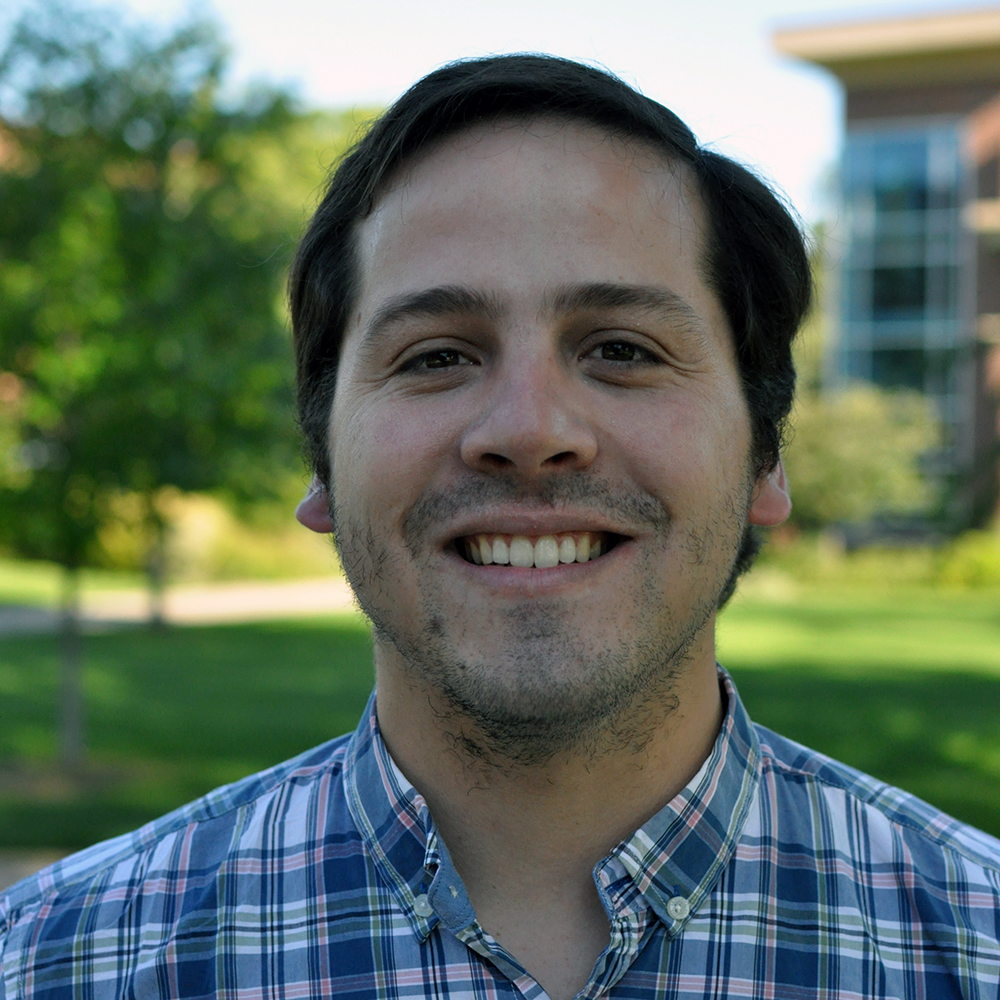

 
  

I am a PhD student and research assistant in the Department of Veterinary Population Medicine at the University of Minnesota. I was born in Uruguay in where I obtained a DVM and MSc from the College of Veterinary Medicine, Universidad de la República, Uruguay. I worked for 4 years as a practitioner in dairy farms, as well as a research assistant focusing on udder health in dairy cows. In 2019 I obtained the Fulbright Scholarship to pursue graduate studies in USA. 

My research looks for a deeper understanding of mastitis epidemiology and new ways to improve udder health in dairy cows. I am currently involved in projects that study bedding management and its impact on udder health, new approaches for mastitis diagnosis and treatment in conventional and organic dairy farms.

